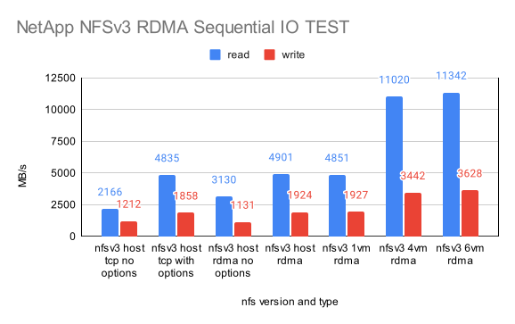
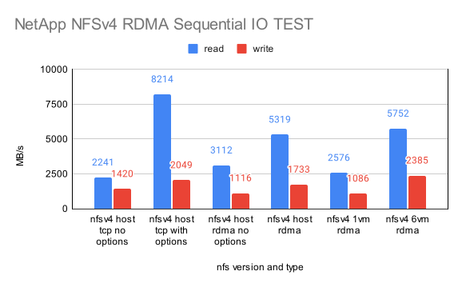
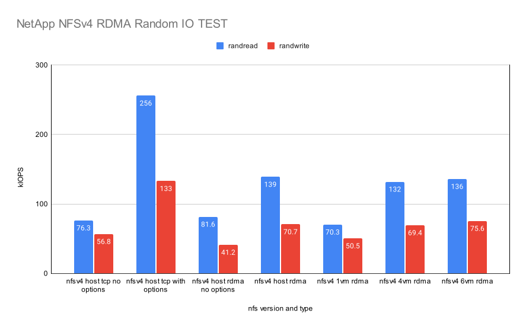

NetApp TCP vs. RDMA Performance test
=======================================

TCP vs. RDMA Transport Layer Performance Test
-----------------------------------------------

RDMA is the networking offload technology and makes data transfer more
efficiently than TCP.
RDMA is widely used for efficient data transfer between clients and storages.

We set up RoCE (RDMA over Converged Ethernet) and enabled NFS over RDMA.
We ran `fio Flexible I/O tester <https://github.com/axboe/fio>`_ and 
measured the throughput for sequential read/write and 
the IOPS for the random read/write.

This tests were performed on a linux client against a linux NFS server
using ramdisk so that the disk latency does not affect to the result and
measure the only transport layer between TCP and RDMA.

* Server

    - Model: HPE ProLiant DL360 Gen10
    - OS: Rocky Linux 8.10
    - CPU: Intel Xeon Gold 6142 CPU @ 2.60GHz * 2 Sockets (64 cores)
    - RAM: 32GB DDR4 2666 MHz * 8 ea
    - Network: Nvidia Mellanox ConnectX-6 Dx 100GbE (Jumbo frame enabled)

* Client

    - Model: HPE ProLiant DL360 Gen10
    - OS: Rocky Linux 8.10
    - CPU: Intel Xeon Silver 4110 CPU @ 2.10GHz * 2 Sockets (32 cores)
    - RAM: 32GB DDR4 2666 MHz * 8 ea
    - Network: Nvidia Mellanox ConnectX-6 Dx 100GbE (Jumbo frame enabled)

This is TCP vs. RoCE Sequential Read/Write IO TEST result.

.. image:: ../_static/images/netapp/tcp_rdma_sequential_read_write_64k_iodepth_128.svg
   :width: 600
   :alt: TCP vs. RDMA Sequential IO TEST

In NFSv3, RoCE is 2.39 times better than TCP in sequential read and 
1.39 times better in sequential write.

In NFSv4, RoCE is 2.23 times better than TCP in sequential read and
1.41 times better in sequential write.

This is TCP vs. RDMA Random Read/Write IO TEST result.

.. image:: ../_static/images/netapp/tcp_rdma_random_read_write_4k_iodepth_128.svg
   :width: 600
   :alt: TCP vs. RDMA Random IO TEST

In NFSv3, RoCE is 1.84 times better than TCP in random read and
1.35 times better in random write.

In NFSv4, RoCE is 2.30 times better than TCP in random read and
1.80 times better in random write.

We can see NFS over RDMA (RoCE) gives a lot of performance boost 
against NFS over TCP at the transport layer.

NetApp NFS RDMA Performance Test
---------------------------------

We set up the burrito system with one control plane node and one compute node
that are connected to NetApp AFF A400 with NFS over RDMA (RoCE).

* Control plane node

    - Model: HPE ProLiant DL360 Gen10
    - OS: Rocky Linux 8.10
    - CPU: Intel Xeon Silver 4110 CPU @ 2.10GHz * 2 Sockets (32 cores)
    - RAM: 32GB DDR4 2666 MHz * 8 ea
    - Network: Nvidia Mellanox ConnectX-6 Dx 100GbE (Jumbo frame enabled)

* Compute node

    - Model: HPE ProLiant DL360 Gen10
    - OS: Rocky Linux 8.10
    - CPU: Intel Xeon Gold 6142 CPU @ 2.60GHz * 2 Sockets (64 cores)
    - RAM: 32GB DDR4 2666 MHz * 8 ea
    - Network: Nvidia Mellanox ConnectX-6 Dx 100GbE (Jumbo frame enabled)

We implemented NFS over RDMA IO test at the host and the virtual machines
with NFSv3 and NFSv4.

We could use `nconnect` mount option with NFSv3 RDMA but we could not use
it with NFSv4 RDMA.
The `remoteports` option from `VAST NFS <https://vastnfs.vastdata.com>`_ 
can be used both NFSv3 and NFSv4.

Here is the NFSv3 mount options.::

    10.1.1.21:/n1data on /var/lib/nova/mnt/7470d2bb4c8c9bfec359ae9781a492ef 
    type nfs (rw,relatime,vers=3,rsize=65536,wsize=65536,namlen=255,hard,
    forcerdirplus,proto=rdma,nconnect=32,port=20049,timeo=600,retrans=2,
    sec=sys,mountaddr=10.1.1.21,mountvers=3,mountproto=tcp,lookupcache=pos,
    local_lock=none,remoteports=10.1.1.21-10.1.1.22,addr=10.1.1.22)

Here is the NFSv4 mount options.::

    10.1.1.21:/n1data on /var/lib/nova/mnt/7470d2bb4c8c9bfec359ae9781a492ef
    type nfs4 (rw,relatime,vers=4.2,rsize=65536,wsize=65536,namlen=255,
    hard,forcerdirplus,proto=rdma,max_connect=2,port=20049,timeo=600,
    retrans=2,sec=sys,clientaddr=10.1.1.13,lookupcache=pos,local_lock=none,
    addr=10.1.1.21)

This is NetApp NFSv3 RDMA Sequential IO TEST result.

The IO Performance at the host is better than that of one virtual machine.
As we increase the number of virtual machines, the sum of throughput is
higher than the throughput of the host since more IO jobs are running
and distributed over the virtual machines.
We could almost saturate RoCE network with 4 virtual machines in 
sequential read IO test.

The maximum throughput in NFSv3 at the virtual machines was 
**11342 MB/s in read** and **3628 MB/s in write**.

This is NetApp NFSv4 RDMA Sequential IO TEST result.

The IO performance at the host is better than that of one virtual machine.
As we increase the number of virtual machines, the sum of throughput is
higher than the throughput of the host since more jobs are running
and distributed over the virtual machines.
We did not test more jobs at the host but it would be better if we tested it.
We could not saturate RoCE network in NFSv4 since we could not use nconnect
with NFSv4 RDMA.

The maximum throughput in NFSv4 at the virtual machines was 
**11342 MB/s in read** and **3628 MB/s in write**.

This is NetApp NFSv3 RDMA Random IO TEST result.

.. image:: ../_static/images/netapp/netapp_nfsv3_rdma_random_iotest.svg
   :width: 600
   :alt: NetApp NFSv3 RDMA Random IO TEST

The IO performance at the host is a lot better than that of one virtual machine.
As we increase the number of virtual machines, the sum of IOPS is increased
since more jobs are running and distributed over the virtual machines.

The maximum IOPS in NFSv3 at the virtual machines was 
**433k IOPS in random read** and **174k random write IOPS**.

This is NetApp NFSv4 RDMA Random IO TEST result.

The IO performance at the host is a lot better than that of one virtual machine.
As we increase the number of virtual machines, the sum of IOPS is increased
since more jobs are running and distributed over the virtual machines.

The maximum IOPS in NFSv4 at the virtual machines was 
**136k IOPS in random read** and **75.6k random write IOPS**.
This is much worse than NFSv3.
It is the same reason as sequential IO test.
We could not use nconnect with NFSv4 RDMA.

For performance, we recommend using NFSv3 over RDMA.

